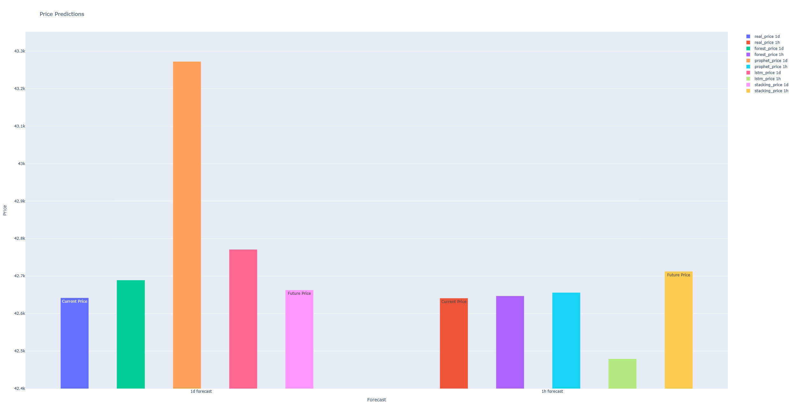

# 0ai.ai
[web](https://0ai.ai) | [twitter](https://twitter.com/zeroai_official) | [telegram channel](https://t.me/ZEROAI_channel)

## Overview
Welcome to the 0ai.ai project! Our mission is to harness the power of artificial intelligence to predict cryptocurrency prices with unparalleled accuracy. This project is at the forefront of blending advanced machine learning techniques with financial forecasting.

## Core Technologies
### 1. Long Short-Term Memory (LSTM) Networks: 
These are a special kind of recurrent neural network (RNN) capable of learning long-term dependencies. In our project, LSTM is instrumental in understanding the time-series data of cryptocurrencies, allowing us to capture patterns over extended periods.

### 2. Neural Prophet:
This is a cutting-edge forecasting tool that combines components from ARIMA (AutoRegressive Integrated Moving Average) models, Recurrent Neural Networks, and additional regressors. It provides an excellent balance between model simplicity and forecasting power, particularly for seasonal trends.

### 3. Random Forests: 
An ensemble learning method known for its robustness and versatility. We use it to predict cryptocurrency prices by analyzing a multitude of decision trees and determining the average prediction from various models, thus increasing the accuracy.

## Methodology
The project operates in two main stages:

**Initial Prediction Models**: Each technology (LSTM, Neural Prophet, and Random Forest) independently predicts daily and hourly cryptocurrency prices. These models are fine-tuned through extensive testing and hyperparameter optimization.

**Meta-Modeling Using Machine Learning**: We then synthesize these individual predictions, comparing them with historical real-world data. The machine learning meta-model harmonizes these diverse predictions into a single, more accurate forecast.

## Current Performance
Our model has demonstrated significant success in predicting prices for cryptocurrencies with substantial historical data, such as Bitcoin and Ethereum.

# Getting Started
Follow these steps to set up the 0ai.ai project on your local machine.
## 1. Clone the Repository
Begin by cloning the repository to your local machine:
```bash
git clone https://github.com/zeroai-official/0ai.ai.git
```
## 2. Navigate to the Project Directory
After cloning the repository, change into the project directory:
```bash
cd zeroai
```
## 3. Download Large Model Files
Due to their size, certain model files are not included in the repository and need to be downloaded separately. For the **ETHUSD_1h_randomforest.joblib** and **XBTUSD_1h_randomforest.joblib** files, please download them from the following Hugging Face links:

* [ETHUSD_1h_randomforest.joblib](https://huggingface.co/yafetful/zeroai/blob/main/ETHUSD_1h_randomforest.joblib)
* [XBTUSD_1h_randomforest.joblib](https://huggingface.co/yafetful/zeroai/blob/main/XBTUSD_1h_randomforest.joblib)
  
After downloading, place these files in the models directory within the project.
## 4. Create a Virtual Environment
Create a virtual environment to manage the project's dependencies:
```bash
python3 -m venv venv
```
## 5. Activate the Virtual Environment
Activate the virtual environment:

On Windows:
```bash
venv\Scripts\activate
```
On Unix or MacOS:
```bash
source venv/bin/activate
```
## 6. Install Dependencies
Install the required dependencies for the project:
```bash
pip install -r requirements.txt
```
## Configuration
Edit the **config.json** file to specify the cryptocurrency you wish to predict. Currently, the available trained models are for BTC and ETH. Note that to fetch data from BitMEX, you should set the symbol to **XBTUSD** for Bitcoin and **ETHUSD** for Ethereum.
## Running the Predictions
* **predict.py:** This script fetches real-time currency prices from Binance and provides predictions for the next day and the next hour.

* **evaluation.py:** This script reads data from the dataset, displays a comparison of historical price predictions, including actual prices, predictions from the three base models, and the final meta-model's predictions.
## Contributing
We welcome contributions from data scientists, AI enthusiasts, and financial analysts. Your expertise can help us refine our models and explore new frontiers in AI-driven financial forecasting.
